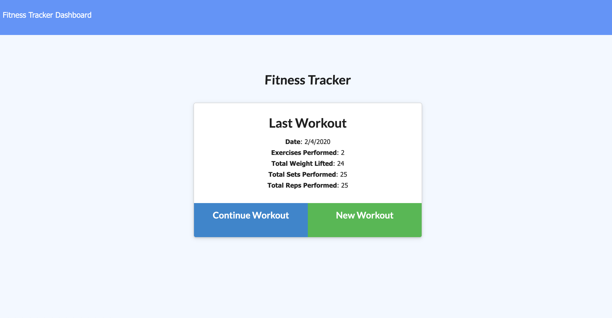
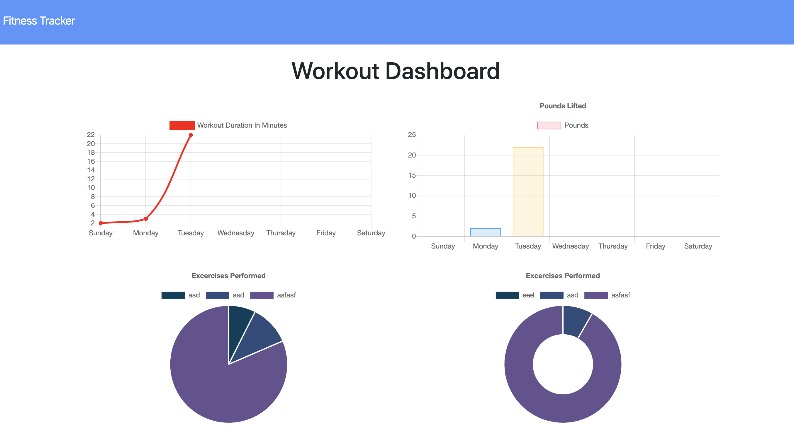

# Fitness_Tracker

<br>

# Summary

An app that allows a user to create and track daily workouts. Exercise info such as duration, weight, sets, reps, distant traveled and type is stored in a No SQL database.
<br>

# Sample Images

Pages are shown in full size and for mobile:


<br>

<br>

# Technologies

- HTML
- CSS
- VScode
- Git
- GitHub
- Bootstrap
- Node.js
- Express
- Mongoose
- MongoDB

# Author

Arman Riahi

# Links

[LinkedIn](https://www.linkedin.com/in/arman-riahi/)
<br>
[GitHub](https://github.com/namrataffy)
<br>

# Code Snippet

Code showing how exercises are added to a workout:

```
app.put("/api/workouts/:workout", (req, res) => {
  let id = req.params.workout;
  let data = req.body;

  db.Exercise.create(data).then(dbExercise => {
    console.log(dbExercise);
    db.Workout.updateOne(
      { _id: mongoose.Types.ObjectId(id) },
      { $push: { exercises: dbExercise } }
    )
      .then(dbWorkout => {
        res.json(dbWorkout);
      })
      .catch(err => {
        res.json(err);
      });
  });
});

```
